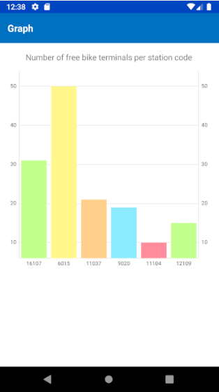
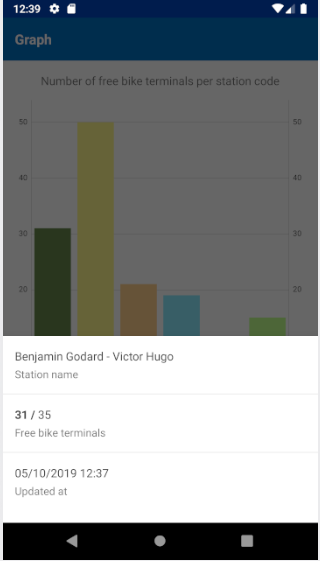

# OpenData-Mobile

## What we want to build :

#### A Mobile Application that will display velibs informations as a Graph.

The application consists of four services:

    Python Service      : Retrieve and Transform data with pandas.
    Mobile Service      : Fetch and Create Graph with retrieve Data.

Both services are implemented using Pandas, [MPAndroidChart](https://github.com/PhilJay/MPAndroidChart)
, Python and Java.

## Versioning

V0.1.0

### Examples

### Pre-requirement

First, install these tools:

- [Python](https://www.python.org)
- [Android Studio](https://developer.android.com)

## How to use it ?

Download and Install the 
